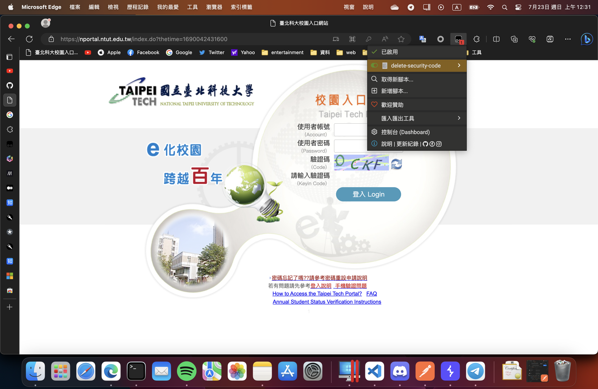
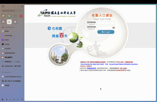

# delete-security-code
移除北科登入介面的驗證碼

## How to use
1. 安裝tempermonkey
    - [edge version](https://microsoftedge.microsoft.com/addons/detail/%E7%AF%A1%E6%94%B9%E7%8C%B4/iikmkjmpaadaobahmlepeloendndfphd?hl=zh-TW)
    - [chrome](https://chrome.google.com/webstore/detail/tampermonkey/dhdgffkkebhmkfjojejmpbldmpobfkfo?hl=zh-TW)
2. 下載[程式碼](https://greasyfork.org/zh-CN/scripts/471454-delete-security-code)

3. 前往[北科登入頁面](https://nportal.ntut.edu.tw/index.do)
4. 若您有看到右上角的開關為開啟的話, 就代表已經啟用

## 說明
此腳本目的在於清除驗證碼的功能，具體實現會在下面的文件說明詳細指示，不過此腳本會有一個問題就是當您在做登入時，會發現他將會登入兩次。這是由於瀏覽器本身限制，想詳細瞭解請至下面文檔查看...

> 以上您會看到在登入的一瞬間會跳出「登入碼錯誤，請重新登入，這是正常的現象

## 文件說明
[詳細說明](./docs/package.md)
